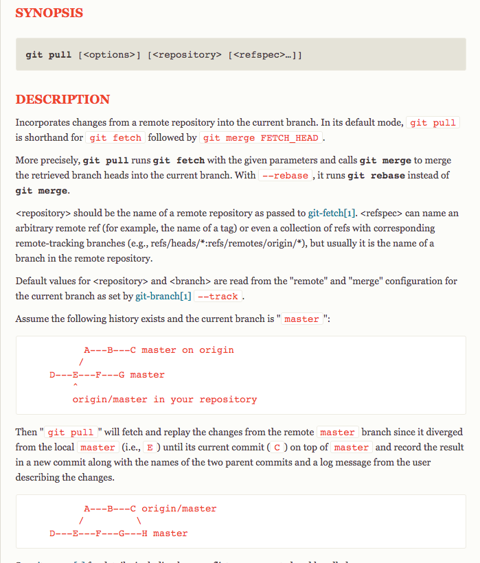
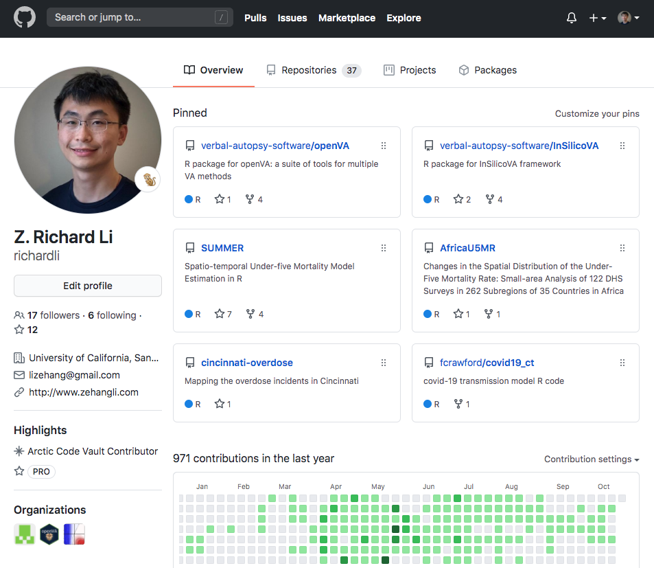
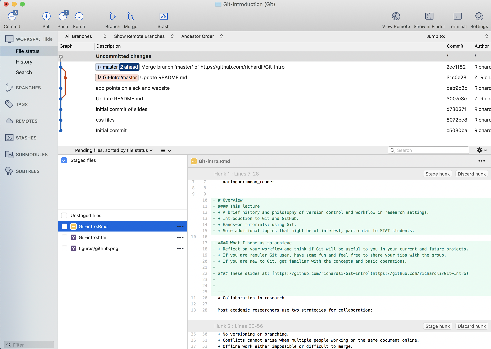
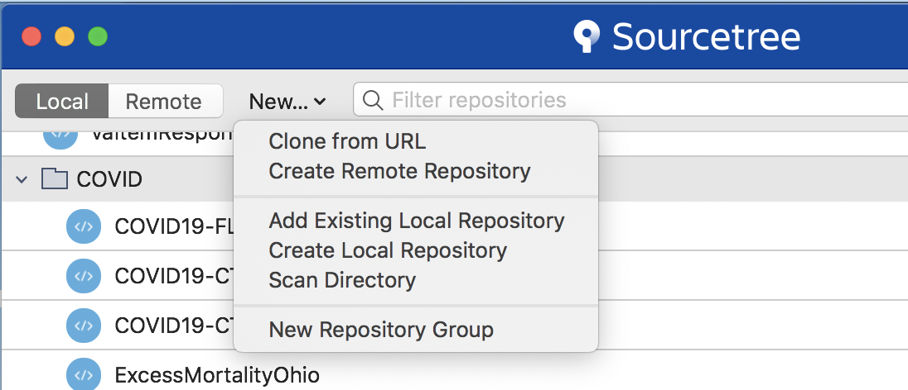
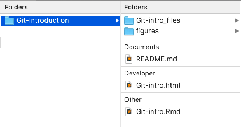
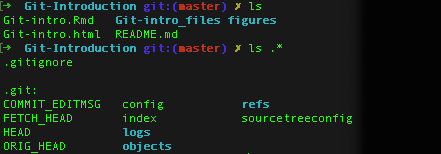
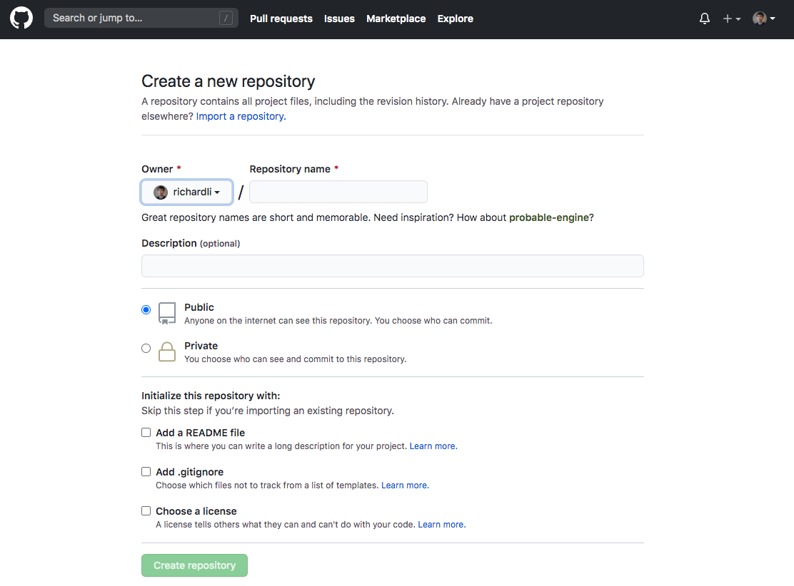
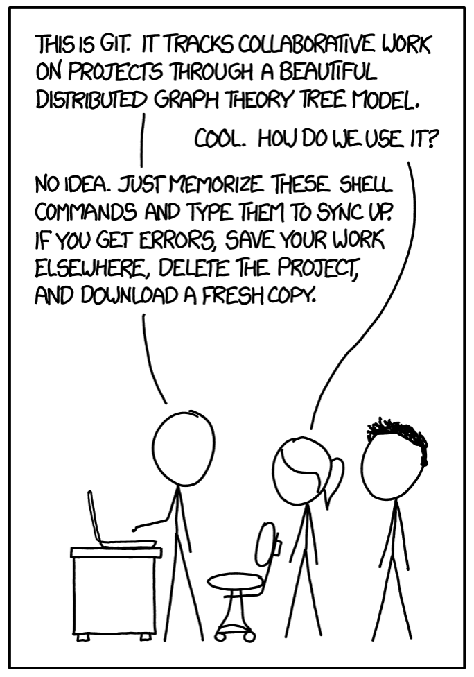

 
# Overview
#### This lecture contains
+ A brief history and philosophy of version control and workflow in research settings. 
+ Introduction to Git and GitHub.
+ Hands-on tutorials: using Git.
+ Some additional topics that might be of interest, particular to STAT students. 

#### What I hope us to achieve
+ Reflect on your workflow and think if Git will be useful to you in your current and future projects.
+ If you are regular Git user, have some fun and feel free to share your tips with the group. 
+ If you are new to Git, get familiar with the concepts and basic operations. 

#### These slides at: [https://github.com/richardli/Git-Intro](https://github.com/richardli/Git-Intro)


---
# Collaboration in research

Most academic researchers use two strategies for collaboration:

**Shared Folders (Dropbox/Box/Google Drive)**

+ Single synced shared folder.
  + `draft_20190717.tex`
  + `draft_20190719_old_backup.tex`
  + `submit_final_final_v3.tex`
+ Simultaneous editing results in conflicts.
  + `submit_final_final_v3 (MIKE D's conflicted copy).tex`
+ Restoring older version is possible.
+ Offline work is possible.
+ Resolving conflicts of different versions manually.
 

---
# Collaboration in research

**Online concurrent editing (Google Docs/Overleaf)**
+ Single synced shared file.
+ Simultaneously editing.
+ Previous versions stored online.
+ No versioning or branching.
+ Conflicts cannot arise when multiple people working on the same document online.
+ Offline work either impossible or difficult to merge.
+ Difficult (impossible?) for collaborative coding projects.


---
# Problems
These strategies work well for rich text document when there is a single main version. 

Managing complex projects can be difficult when you have 
  + many files, directories, and dependencies,
  + many people contributing and making edits on different files,
  + different "working versions" that are similar and exist in parallel for a period of time.

These approaches do not scale to complex collaborative projects. Someone needs to be on top of all the files and changes to fix any errors (without destroying other changes).

####System for managing collaboration
In software engineering, workers have developed _social and technological solutions_ to the problem of managing collaborative work. 

The technological aspect of this system is usually called _version control_.


---
# Why version control 
Version control helps team (or even individual!) manage and keep track of changes over time. 

In collaborative work, it is not reasonable to block collaborators from working on the project while one person makes changes to a single file
    
It is easier for team members to work in parallel and keep track of each change: who made what change at what point in time and why. 

Merging multiple changes on the same file is always painstaking -- what if there is a tool to make it somewhat automatic and easier to track?


 
---
# Git

Git was created by Linus Torvalds, the inventor of Linux, in 2005 to manage work by hundreds of developers on the Linux kernel.

Git was designed for software development by large teams. But it is useful for many kinds of projects.

**Big ideas**
+ distributed, parallel workflow
+ every contributor has a full copy of the repository and its history
+ fast and scalable.

---
# Git
Unfortunately Git can be difficult to learn for people unfamiliar with modern software development practices and newcomers to version control.


```{r echo = FALSE, out.width = "50%", fig.align = 'center'}

```

---
# GitHub 
GitHub  is an online platform for hosting Git repositories.

GitHub  offers many additional services:
+ Access control
+ Issue tracking
+ Pull requests with code review and comments
+ Markdown rendering
+ Gists
+ Wikis
+ GitHub  pages
+ Integration with other productivity/teamwork apps (e.g., Slack)

An academic GitHub  account with unlimited public and private repositories is free.

---
.center[]

---
# Getting started with Git

Do you have Git? On the UNIX command line (terminal app in mac and cmd in windows), type:

```bash
git --version
```
If you do not have Git, follow these instructions:

[https://www.atlassian.com/git/tutorials/install-git](https://www.atlassian.com/git/tutorials/install-git)

If you do not have an GitHub  account, sign up at: 

[https://github.com/](https://github.com/)


---
# Graphical interfaces to Git

GitHub  Desktop and Sourcetree are two of the most popular GUIs. I will use Sourcetree in this tutorial. You can connect your GitHub  account (or other online platforms) to Sourcetree in `Preferences > Accounts`.

.center[]


---
# Basics of Git workflow
Today I will cover only a small part of the workflow:

1. Clone a remote repo
2. Create your own local or remote repo
3. Making and tracking changes
4. Merging changes from someone else

These simple steps cover a large proportion of routine workflow with Git.

---
# Tutorial I: clone these slides
.center[[https://github.com/richardli/Git-Intro](https://github.com/richardli/Git-Intro)]

.pull-left[ 
  From the web page:
  
]
.pull-right[ 
  From Sourcetree:
  
]


These are your local copies. Making changes does not affect the upstream repo (in my account). 

What if you want to collaborate in someone else's repo?
+ Ask to be added as collaborator
+ Forking and Pull request (propose one-time changes to others' repos)

---
# Tutorial I: look inside a repo

.pull-left[ 
  
]
.pull-right[ 
  
]

+ **README**
  + Things the authors want people to know upfront.
+ **.git**
  + A directory of lots of goodies in your project -- you don't need to interact with it directly. 
+ **.gitignore** 
  + A file that tells git which files should not be tracked.


---
# Tutorial I: look into the past
.center[]

---
# Tutorial II: Create your remote repo
.center[]

---
# Tutorial II: Create your local repo
.center[]

---
# Tutorial III: More than Cmd+S
In Git, a 'commit' is a collection of changes in the repository. 

#### Making changes
+ Edit the files

#### Stage changes
+ The files that are ready to form the next *commit* 

#### Commit changes
+ Save the staged changes to the local repository and add message to yourself and others

#### Push changes (if you have a remote repo)
+ Send the changes to the remote repo


---
# Tutorial III: ~~Oops, scratch that~~

#### Checkout
+ Temporarily switching to a past point (remember not making changes)

#### Revert
+ Undo the last commit

#### Reset
+ Rest every _tracked_ file to a specific point in time (remember to check files in .gitignore) 
  

---
# Now, collaborating with Git
Just using Git on your own is complicated. 

Using Git to collaborate with several other people on a project can be difficult.

```{r echo = FALSE, out.width = "38%", fig.align = 'center'}

```

<center>
  https://imgs.xkcd.com/comics/git.png 
</center>

---
# Tutorial IV: Am I ready to push?
+ **Pull** before push
  * get the remote updates others have made.

+ If nothing shows up after pulling --> awesome!

+ Otherwise, likely you have a merge conflict
  * This happens when you and your collaborator made changes on the same lines of codes in the same file, that Git does not know how to resolve automatically.
  * You will need to tell Git what final version would be.
  * There are different tools to make the side-by-side comparison easier visually. 
  * If you are in doubt, don't force it. Communicate with your collaborator.


---
# Some practical considerations

###Some useful practices
+ Make small and frequent commits with detailed (and searchable) messages.
+ Git diff are line-based, so make lines small. 
+ Break up codes into several files. 
+ Try not to leave uncommitted changes open for a long time.
+ Use .gitignore wisely.

###Be aware of
+ Rich texts (e.g., .docx, .xlsx) 
+ Very large files (e.g., high resolution pdf, large .RData files)
+ **Sensitive information (e.g., passwords, sensitive data)**


---
# Additional topics
### Latex
+ `.gitignore` can be very helpful in maintaining only the necessary files to compile (no .aux, .log, .out, .bbl, .blg, ..., or even the paper.pdf)
+ Some people use a Makefile to compile, which can be useful when you have multiple .tex files.
+ Line break after each sentence is good for git diff to track, but can be annoying to collaborators (or yourself!)
+ Overleaf/ShareLaTex is a good alternative (when you have good internet).

---
# Additional topics
### R packages
+ The GitHub repo is the package.
+ There are tools to make it easy to make releases, generate help files, and for others to install directly from GitHub and provide feedback.
+ Many more flexible features to write documents, vignettes, and websites, e.g., [pkgdown](https://pkgdown.r-lib.org/)
+ Tools to check your package can build, install, and 'works', e.g., [TravisCI](https://docs.travis-ci.com/user/languages/r)  

### GitHub pages
+ A very useful way to set up your personal/professional website or specific projects: [pages.github](https://pages.github.com/).

---
# So, will my Git now go smoothly?
.center[]


---
# Don't be discouraged!


.center[### Git is expressly designed to make you feel less intelligent than you thought you were.] 

.right[-- Andrew Morton, when introducing Linus Torvalds <br>at a 2007 Google tech talk]

<br>
.center[### So I think it used to be true but isn’t any more. There is a few reasons people feel that way, but I think only one of them remains. The one that remains is fairly simple: “you can do things so many ways.” ... Generally, the best way to learn git is probably to first only do very basic things and not even look at some of the things you can do until you are familiar and confident about the basics.]

.right[-- Linus Torvalds, 2015]


---
## Topics not covered here

Branching

Pull requests

Command line Git

GitHub  issues page

...

---
# Resources

There are many git tutorials out there. 

What if I have a problem? Google it.

Likely you will find different people asking the same question over and over again over many years!


